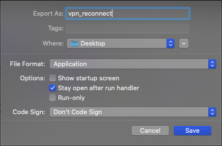

# mac_vpn_reconnect
AppleScript that reconnects a VPN connection.

To run export from Script Editor as Application and check the "Stay open after run handler" checkbox.

Change the interval by changing the return value in the script from 10 (seconds) to something else.
